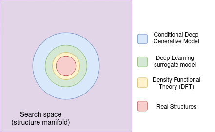

# Hierarchical generative and regressive machine learning for next generation materials screening

This repository contains the source code for the paper:

> Ortega, Raul & Benediktsson, Bardi & Sechi, Renata & Jørgensen, Peter & Bhowmik, Arghya. (2023). ["Materials Funnel 2.0 - Data-driven hierarchical search for exploration of vast chemical spaces"](https://chemrxiv.org/engage/chemrxiv/article-details/65130f76ade1178b2429cd68). 10.26434/chemrxiv-2023-s8t6s-v2. 

For the source code of the web-application https://github.com/raulorteg/hts_funnel-app




It builds up on the code from https://github.com/wengong-jin/hgraph2graph (generator) and https://github.com/masashitsubaki/QuantumDeepField_molecule (surrogate)

## Installation 
------------------------------
1. Clone the repository: ```git clone https://github.com/raulorteg/hts_funnel```
2. Create the python virtual environment (I use python 3.9.14): ```virtualenv --py=python3.9 hts_funnel```
3. Activate virtualenv  ```source hts_funnel/bin/activate```
4. Install requirements ```python -m pip install -r requirements.txt``` Note: Your system might need a different torch installation (https://pytorch.org/get-started/locally/)

## Requirements
------------------------------

see the ```requirements.txt``` file


## Usage
------------------------------

In `/scripts` you may find some scripts prepared to run the pipeline.

```bash
python scripts/main.py --cond=<cond> --num_samples=<num_samples> --threshold=<threshold>
```

Options:

* `cond`: [float] Desired value of the homo-lumo gap in eV for the design of the molecules.
* `num_samples`: [int] Number of initial samples for the generator to produce in the initial step. Defaults to 100.
* `fout`: [str] Filename to save the outputs of the funnel process. Defatuls to results_funnel.txt.

Example:

    python main.py --cond=2.6 --num_samples=500

The example above would trigger the pipeline to generate molecules with a target homo-lumo gap of *2.6 eV*, starting with *500* initial samples produced by the generator. Then the generated samples are filtered using the surrogate predictions, and the final results of molecular candidates will be saved in smiles format in `data/results_funnel.txt`: where the first column is the SMILES encoding of the molecules, the second is the condition given (eV) for their generation, and the third column is the predicted condition (by the Surrogate, in eV).


## Docker
------------------------------

Build the Docker image
```bash
sudo docker build . --tag="funnel:latest"
```

Run the docker image
```bash
sudo docker run -v $PWD/data:/funnel/data -it --rm funnel:latest --cond=2.0 --num_samples=100
```

Then the results will be at `data/results_funnel.txt`

## Code formatting
Use isort 5.10.1 and black 22.10.0:
```bash
python -m pip install isort==5.10.1 black==22.10.0 
```

Sort the imports:
```bash
python -m isort <file_or_directory>
```


To format:
```bash
python -m black <file_or_directory>
```

## Testing
```
python -m pip install pytest=7.2.0
```
Then, on `tests` (-q for quiet)
```
python -m pytest [-q] .
```